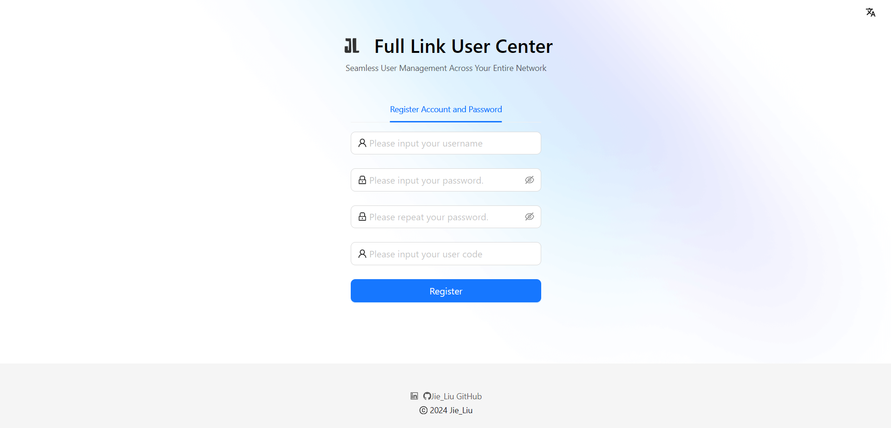

# User Center Project

## Project Overview
This User Center project is a full-stack application that implements a comprehensive user management system. It features user registration, login functionality, and an admin panel for user management.

## Technologies Used

### Frontend:
- React
- Ant Design
- Umi
- Ant Design Pro

### Backend:
- Java
- Spring Boot
- MyBatis
- MyBatis-Plus
- MySQL

## Features Implemented

1. User Registration
2. User Login
3. User Logout
4. User Management (Admin only)
   - View user list
   - Search users
   - Delete users

## Key Learnings

- Setting up a full-stack project with React and Spring Boot
- Implementing user authentication and authorization
- Using Ant Design Pro for rapid UI development
- Working with MyBatis-Plus for simplified database operations
- Implementing RESTful APIs
- Handling cross-origin requests (CORS)
- Implementing global exception handling
- Using Umi for routing in React applications

## Project Structure

### Frontend:
- Used Ant Design Pro for UI components
- Implemented custom pages for login, registration, and user management
- Utilized Umi for routing and state management

### Backend:
- Developed RESTful APIs for user operations
- Implemented user authentication using sessions
- Used MyBatis-Plus for database operations
- Implemented global exception handling for better error management

## Screenshots

### Login Page

### Register Page

### User Management Page

## Future Improvements

- [ ] Implement email verification for new user registrations
- [ ] Add password reset functionality
- [ ] Enhance user profile management
- [ ] Implement role-based access control for more granular permissions